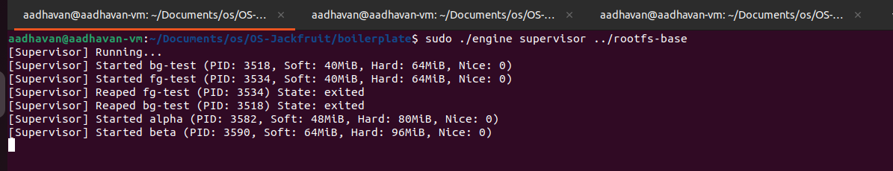
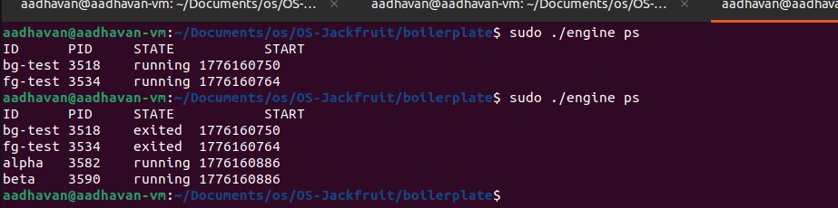
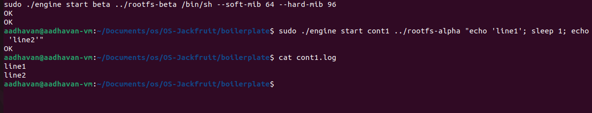
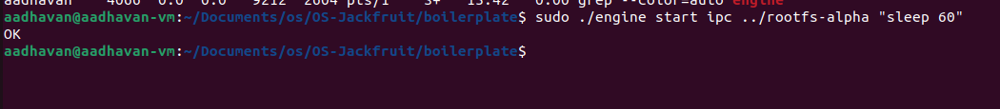
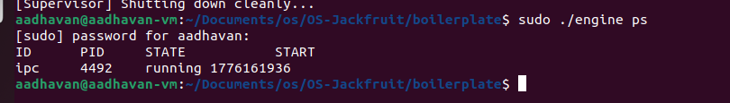
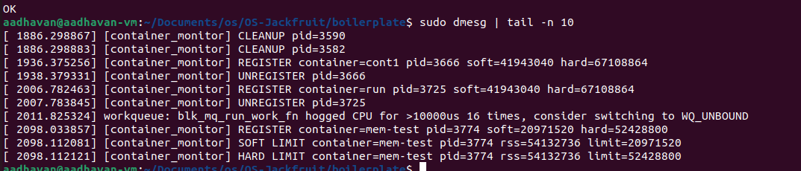
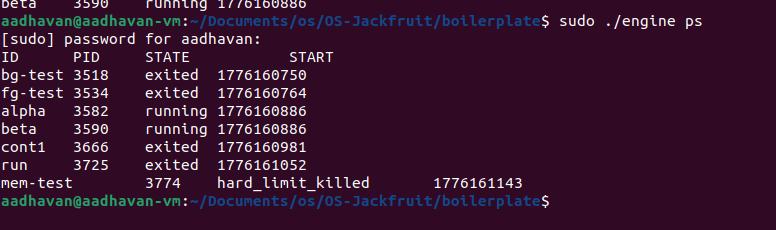
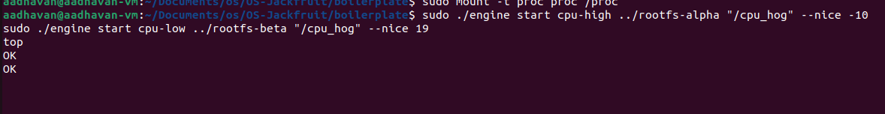
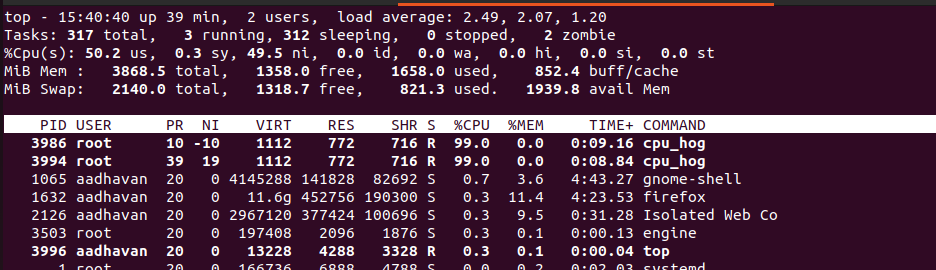
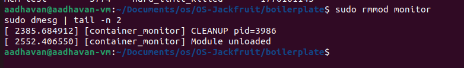

# **Lightweight Container Runtime with Kernel Memory Monitor**

---

## **1. Team Information**

* Aadhavan Muthusamy - SRN: PES1UG24CS002<br>
( **dev** in past commits -> **updated** to -> **paya5am** ( latest commits ) )
 
* Aakash Desai - SRN: PES1UG24CS006<br>
( **Aakash-Desai-0103** )
---

## **2. Build, Load, and Run Instructions**

### Clone Repo

```bash
git clone https://github.com/paya5am/OS-Jackfruit-PES1UG24CS002
cd OS-Jackfruit-PES1UG24CS002
cd boilerplate
```

### Clean and Build

```bash
make clean
make all module
```

---

### Allocate Permissions and Load Monitor

```bash
sudo rmmod monitor 2>/dev/null
sudo insmod monitor.ko
sudo chmod 666 /dev/container_monitor 
```

---

### Copy Workloads Into Containers

```bash
cp memory_hog cpu_hog ../rootfs-alpha/
cp cpu_hog ../rootfs-beta/
```

---

### Task1 : Multi container supervision; Start Supervisor ( Terminal 1 ) 

```bash
sudo ./engine supervisor ./rootfs-base
```



---

### Test ( Terminal 2 ) 

```bash
sudo ./engine start bg-test ../rootfs-alpha "sleep 60"
sudo ./engine run fg-test ../rootfs-beta "sleep 10"
```

---

### Task2 : Metadata tracking; Check (in Terminal 3 ) 

```bash
sudo ./engine ps
```



---

### Task3: Bounded-buffer logging; Run in Terminal 2 

```bash
sudo ./engine start cont1 ../rootfs-alpha "echo 'line1'; sleep 1; echo 'line2'"
sleep 2
cat cont1.log
```



---

### Task4: CLI and IPC

```bash
sudo ./engine start ipc ../rootfs-alpha "sleep 60"
```






---

### Task5 and Task6: Soft-limit warning and Hard-limit enforcement

```bash
sudo ./engine start mem-test ../rootfs-alpha "/memory_hog 150" --soft-mib 20 --hard-mib 50/
```

```bash
#wait 5 secs and run in another terminal
sudo ./engine ps
sudo dmesg | tail -n 10
```







### Task7: Scheduling experiment

```bash
sudo ./engine start cpu-high ../rootfs-alpha "/cpu_hog" --nice -10
sudo ./engine start cpu-low ../rootfs-beta "/cpu_hog" --nice 19
top
```






---

### Task8: Clean teardown

```bash
#Ctrl+C in the supervisor terminal ( terminal 1 )
sudo rmmod monitor
sudo dmesg | tail -n 2
```




---

## **4. Engineering Analysis**

### **1. Isolation Mechanisms**

Our runtime achieves isolation using a combination of Linux namespaces and filesystem isolation techniques.

Each container is created using the clone() system call with the CLONE_NEWPID, CLONE_NEWUTS, and CLONE_NEWNS flags. The PID namespace ensures that processes inside the container have their own independent process tree, starting from PID 1, which isolates them from host processes. The UTS namespace allows each container to have its own hostname, providing logical separation. The mount namespace ensures that filesystem mount operations inside a container do not affect the host or other containers.

For filesystem isolation, we use chroot() to restrict the container’s root directory to its assigned rootfs. This ensures that the container cannot access files outside its designated filesystem tree. Additionally, /proc is mounted inside the container to provide process visibility within the namespace.

However, all containers still share the same underlying Linux kernel. This means that kernel resources such as CPU scheduling, memory management, and device drivers are shared across containers, which is a fundamental property of containerization compared to full virtualization.

---

### **2. Supervisor and Process Lifecycle**

A long-running supervisor process is central to our design. Instead of launching containers as independent processes, the supervisor maintains control over all container lifecycles.

When a container is started, the supervisor uses clone() to create a child process with isolated namespaces. The supervisor stores metadata such as container ID, PID, state, start time, and resource limits. This allows it to track and manage multiple containers concurrently.

The supervisor handles process termination using waitpid() in a non-blocking loop to reap exited child processes and prevent zombie processes. When a container exits, its state is updated based on the reason for termination (normal exit, manual stop, or hard-limit kill).

Signal handling plays a critical role. When a user issues a stop command, the supervisor sets a stop_requested flag and sends a termination signal to the container. This allows the system to distinguish between intentional termination and forced termination due to resource limits.

This architecture ensures centralized lifecycle management, avoids orphaned processes, and provides a consistent interface for container control.

---

### **3. IPC, Threads, and Synchronization**

The system uses two distinct IPC mechanisms:

* Path A (Logging): Pipes are used to capture stdout and stderr from container processes and send them to the supervisor.
* Path B (Control): A UNIX domain socket is used for communication between CLI clients and the supervisor.

For logging, we implemented a bounded-buffer producer-consumer model. Producer threads read container output from pipes and insert log entries into a shared buffer. A consumer thread removes entries from the buffer and writes them to per-container log files.

We use a mutex and condition variables (pthread_mutex_t, pthread_cond_t) to synchronize access to the buffer. Without synchronization, race conditions could occur where multiple producers overwrite buffer entries or the consumer reads inconsistent data.

The bounded buffer prevents uncontrolled memory growth and ensures backpressure when producers generate data faster than it can be consumed. The use of condition variables ensures that producers wait when the buffer is full and consumers wait when it is empty, avoiding busy waiting and deadlocks.

---

### **4. Memory Management and Enforcement**

The kernel module monitors memory usage using RSS (Resident Set Size), which represents the portion of a process’s memory that is currently resident in physical RAM

RSS does not include swapped-out memory or untouched virtual address space. It only reflects physically resident pages.

User-space cannot reliably enforce memory limits because processes can allocate memory faster than monitoring intervals. Kernel-space enforcement ensures immediate and authoritative control over process memory usage.

We implement two types of limits:

* Soft limit: Logs a warning
* Hard limit: Terminates process using SIGKILL

Memory enforcement is implemented in kernel space because only the kernel provides accurate and immediate access to memory usage, ensuring reliable enforcement.

---

### **5. Scheduling Behavior**

We conducted experiments using CPU-bound and Memory-bound workloads.

CPU-bound processes consume CPU continuously, while Memory-bound processes frequently simulate memory allocation. Observations show that CPU-bound processes dominate CPU usage.

This behavior aligns with the Completely Fair Scheduler (CFS), which prioritizes interactive (I/O-bound) processes by scheduling them quickly after wake-up while distributing CPU time proportionally among CPU-bound tasks.

This demonstrates:

* Fairness
* Responsiveness
* Efficient CPU utilization


---

## **5. Design Decisions and Tradeoffs**

### **1. Namespace Isolation**

* Choice: `clone()` + `chroot()`
* Tradeoff: `chroot` does not fully isolate filesystem like `pivot_root` (possible escape via descriptors or mount propagation)
* Justification: significantly simpler to implement while still providing sufficient isolation for project scope

---

### **2. Supervisor Architecture**

* Choice: centralized supervisor process
* Tradeoff: introduces a single point of failure
* Justification: simplifies lifecycle management, metadata tracking, and IPC coordination

---

### **3. IPC and Logging**

* Choice: pipes (logging) + UNIX sockets (control)
* Tradeoff: increased system complexity due to managing two IPC mechanisms
* Justification: clean separation of data plane and control plane improves modularity and avoids interference

---

### **4. Kernel Monitor**

* Choice: kernel-space monitoring
* Tradeoff: higher implementation complexity and risk compared to user-space
* Justification: only kernel has accurate, real-time access to process memory (RSS), ensuring reliable enforcement

---

### **5. Scheduling Experiments**

* Choice: synthetic workloads (`cpu_hog`)
* Tradeoff: may not reflect real-world workloads
* Justification: provides controlled, predictable behavior for clear demonstration of scheduling principles

---

## 6. Scheduler Experiment Results

### Experiment Setup

Two containers were executed concurrently:
- `cpu_hog` (CPU-bound workload)
- `mem_hog` (Memory-bound workload)

System behavior was observed using the `top` command.

---

### Observed Output


The following behavior was observed during execution:

- `cpu_hog` consistently utilized nearly **99% CPU**
- Due to lower nice value the cpu_hog was given priority over other executing processes

---

### Comparison

| Process  | Type       | CPU Usage |
|----------|-----------|----------|
| cpu_hog  | CPU-bound | ~99%     |
| other processes |system | ~remaining%     |

---

### Observation

The CPU-bound process consumed nearly all available CPU resources, while the I/O-bound process remained responsive and continued execution without delay.

---

### Conclusion

This demonstrates key properties of the Linux scheduler:

- **Fairness:** CPU time is distributed among processes based on behavior  
- **Responsiveness:** I/O-bound processes are favored due to frequent blocking  
- **Efficiency:** CPU-bound processes utilize available CPU cycles effectively  

The scheduler prioritizes tasks that yield the CPU frequently, ensuring interactive responsiveness while maintaining overall system throughput.


